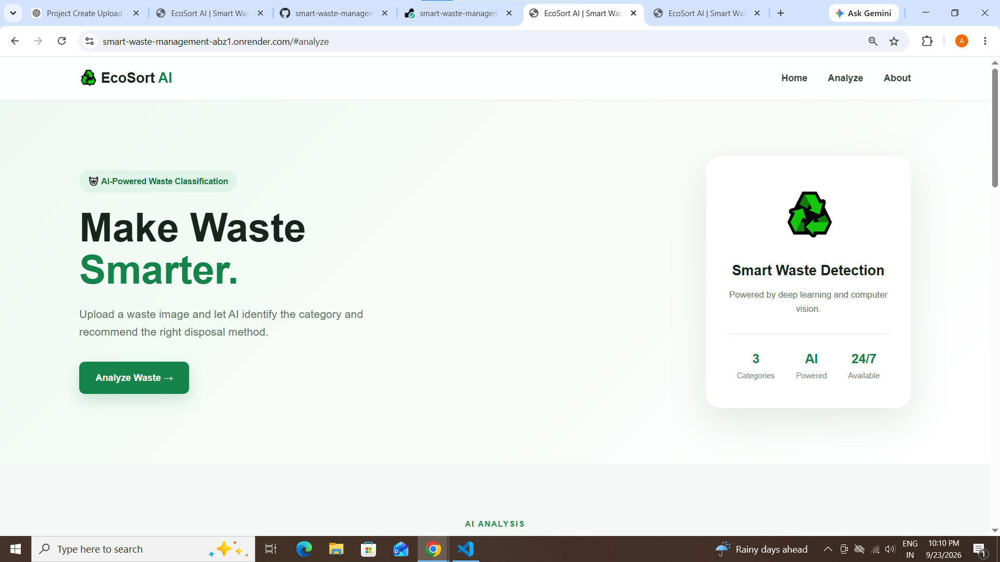
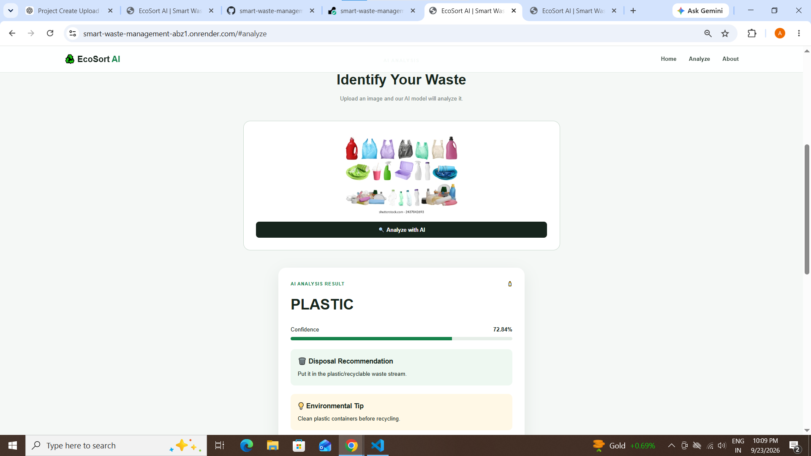

# ♻️ EcoSort AI — Smart Waste Management

EcoSort AI is a personal AI/ML project that uses image classification to identify waste as **Organic, Paper, or Plastic**.

Users can upload a waste image, and the system predicts the waste category along with a confidence score, disposal recommendation, and recycling tip.

## 🚀 Live Demo

https://smart-waste-management-abz1.onrender.com

## ✨ Features

- Upload a waste image
- AI-based waste classification
- Detects:
  - 🌱 Organic
  - 📄 Paper
  - 🧴 Plastic
- Displays prediction confidence
- Provides disposal recommendations
- Provides recycling tips
- Responsive web interface

## 🧠 How It Works

1. User uploads a waste image.
2. The image is resized and preprocessed.
3. A ResNet18 deep learning model analyzes the image.
4. The model predicts the waste category.
5. The application displays the result and disposal guidance.

## 🛠️ Technologies Used

- Python
- PyTorch
- Torchvision
- ResNet18
- Flask
- HTML
- CSS
- JavaScript
- GitHub
- Render

## 📂 Project Structure

```text
smart-waste-management/
│
├── app.py
├── train.py
├── requirements.txt
├── README.md
│
├── templates/
│   └── index.html
│
└── static/
    ├── style.css
    └── script.js

So it becomes exactly:

```
## 📸 Screenshots

### 🏠 Home Page


### 🤖 AI Prediction

